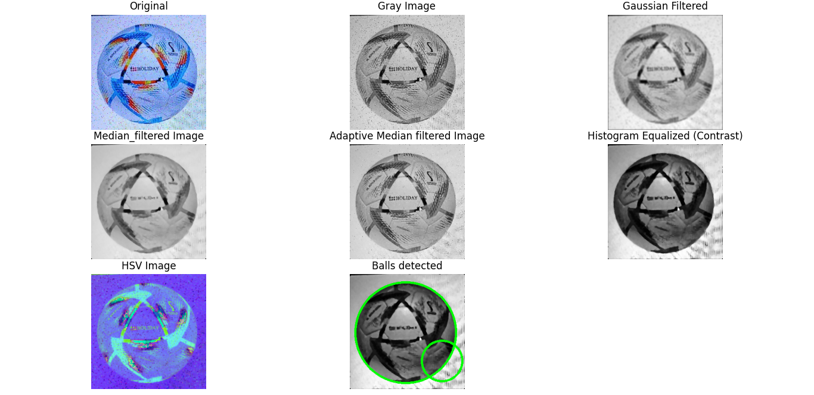
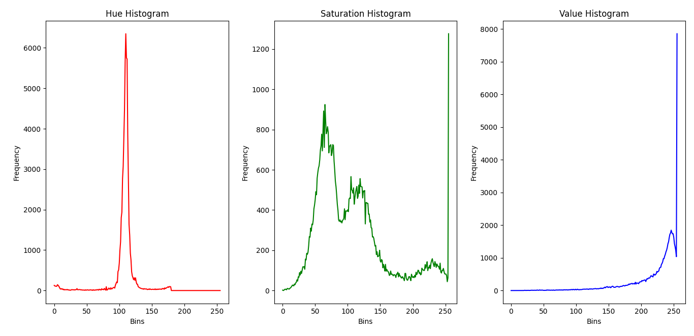

# Sport Ball Detection using Image Processing Techniques

This project aims to detect sport balls from noisy color images using image processing techniques and the OpenCV library in Python.

## Project Summary

This project utilizes various image processing steps, including applying mean, adaptive median, and Gaussian filters, improving image contrast, dominant color analysis, and using the Hough Circle Transform for circle detection.

## Features

*   Noise removal using various filters (Mean, Adaptive Median, Gaussian)
*   Image contrast enhancement with histogram equalization
*   Dominant color analysis and color feature extraction
*   Circle detection using the Hough Circle Transform
*   Implemented in Python with OpenCV

## Prerequisites

To run this project, you need the following:

*   Python 3
*   OpenCV (`pip install opencv-python`)
*   NumPy (`pip install numpy`)
*   Matplotlib (`pip install matplotlib`)

## How to Run

1.  Clone the repository:

    ```bash
    git clone [https://github.com/YOUR_USERNAME/YOUR_REPOSITORY.git](https://github.com/YOUR_USERNAME/YOUR_REPOSITORY.git)
    ```

2.  Navigate to the project directory:

    ```bash
    cd YOUR_REPOSITORY
    ```

3.  Run the Python script:

    ```bash
    python main.py
    ```

    (Assuming your main file is named `main.py`. Replace it with your actual main file name.)

## Code Structure

*   `img/`: Contains input images.
*   `modules/`: Contains image processing functions and modules:
    *   `median.py`: Contains median and adaptive median filter functions.
    *   `gaussian.py`: Contains Gaussian filter functions.
    *   `hist.py`: Contains histogram equalization and dominant color analysis functions.
    *   `restore.py`: Contains image restoration functions.
    *   `hough_circle.py`: Contains circle detection functions using the Hough Transform.
*   `main.py`: The main script to run the project.

## Workflow (Briefly)

1.  **Image Preprocessing:** Load image, resize, and convert to grayscale.
2.  **Noise Removal:** Apply Gaussian, median, and adaptive median filters.
3.  **Contrast Enhancement:** Histogram equalization.
4.  **Color Analysis:** Extract color features using dominant color analysis.
5.  **Ball Detection:** Use the Hough Circle Transform to identify circles.

## Results and Analysis

Median and adaptive median filters significantly impacted noise removal and improved image quality. Dominant color analysis and histograms were useful in extracting color features. The Hough Transform provided good accuracy in detecting circles.





## Conclusion

This project demonstrated that combining various image processing techniques can effectively detect objects, including sport balls. However, machine learning and deep learning algorithms are much more suitable options.

## Developers

*   Ali Valizadeh ([AliValizade](https://github.com/AliValizade))

## Supervisor

*   Dr. Boshra Rajaee
